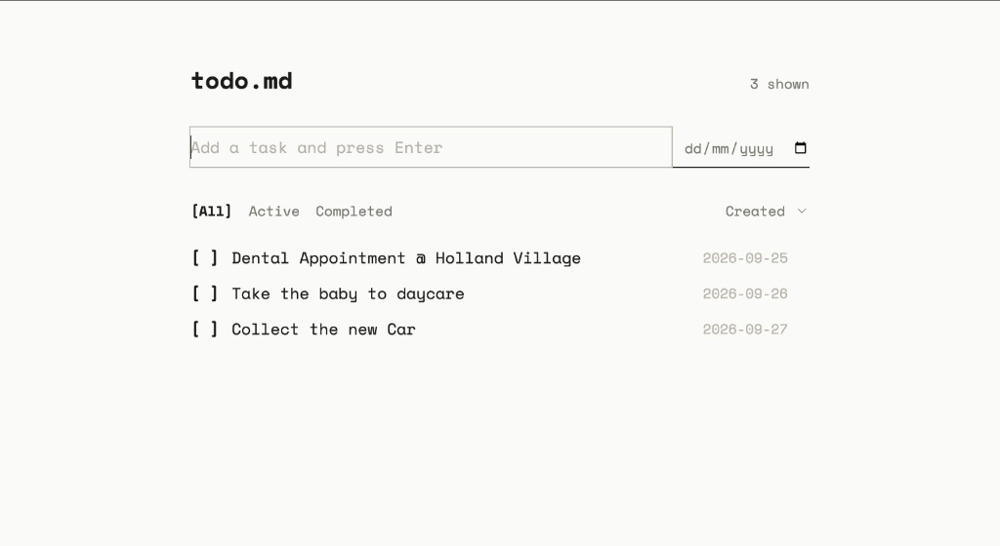
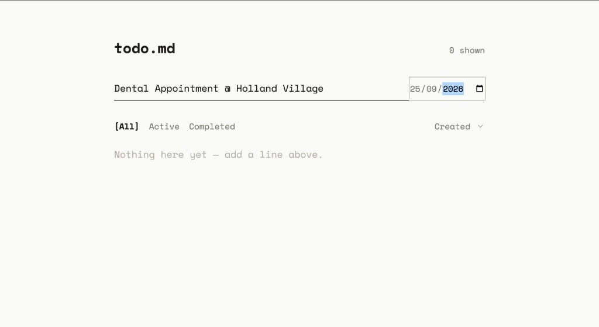
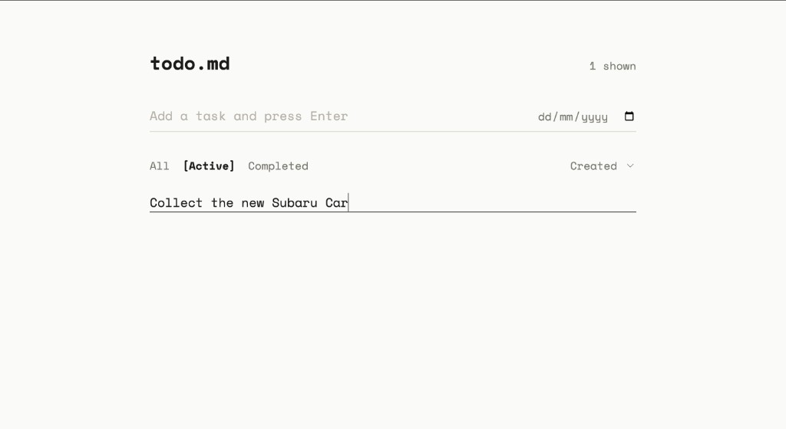
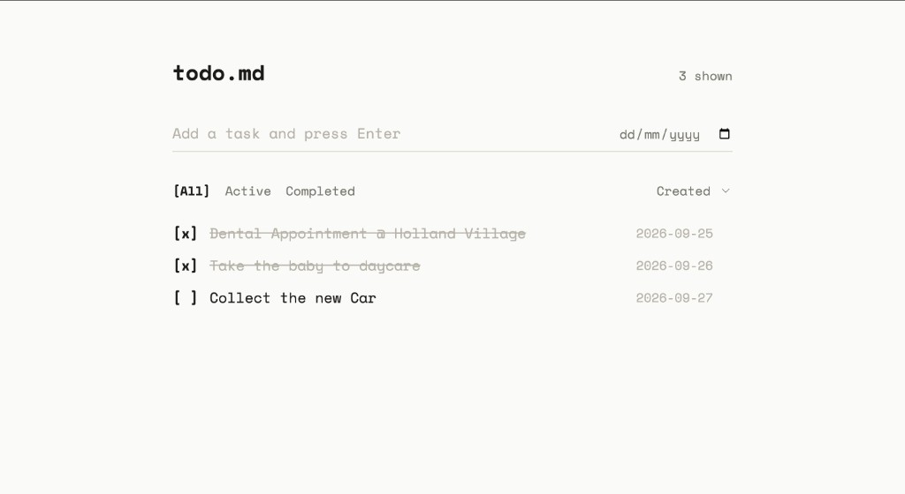
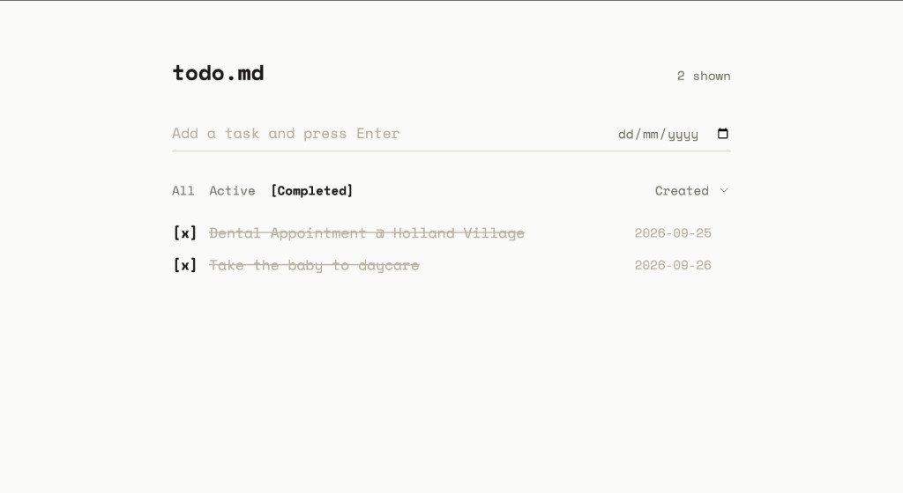

# Todolist

A local task manager: FastAPI + SQLite on the backend, React + TypeScript + Vite on the frontend.



## Requirements

- Python 3.11+
- Node.js 18+ (Node 20+ preferred)
- `make`

## Start the app

From the repo root:

```bash
make setup
make dev
```

Then open **http://localhost:5173**.

`make setup` installs Python packages from `requirements.txt` and frontend packages via npm. Run it once, or again after dependency changes.

`make dev` starts both processes:

| Process | URL |
|---|---|
| UI (Vite) | http://localhost:5173 |
| API (FastAPI) | http://localhost:8000 |

Tasks are stored in `tasks.db` at the repo root. That file is created on first launch and is gitignored.

Stop the servers with `Ctrl+C`. If a leftover process is still bound to a port, stop it before running `make dev` again.

### Run one side only

```bash
make dev-backend    # API only, port 8000
make dev-frontend   # UI only, port 5173
```

The UI calls `http://localhost:8000`, so the backend must be running for the page to load tasks.

## Other commands

```bash
make test      # pytest
make check     # typecheck, lint, frontend build, pytest
make lint      # ruff + eslint
make build     # production frontend bundle
```

## What you can do

Add a task with an optional due date:



Click a task to edit it:



Mark tasks complete:



Filter by All, Active, or Completed:


