# Reflections

(may need to open with Cmd+Shift+V to view the images attached)

## 1. How did you breakdown the problem before prompting?

My approach to the problem was three phased.

First, to align with spec-driven development, I built a rigorous harness using my own CLI tool, aiready (1,400+ downloads), which I created for exactly this purpose. It strengthens a harness across five subsystems: identity, verification, state, memory, and constraints, using intent-based LLM scoring. I started by writing a minimal artifact, minimal_plan.md, containing my decisions on the preferred tech stack, core features, additional features I wanted to add, constraints, and frontend design guidance.

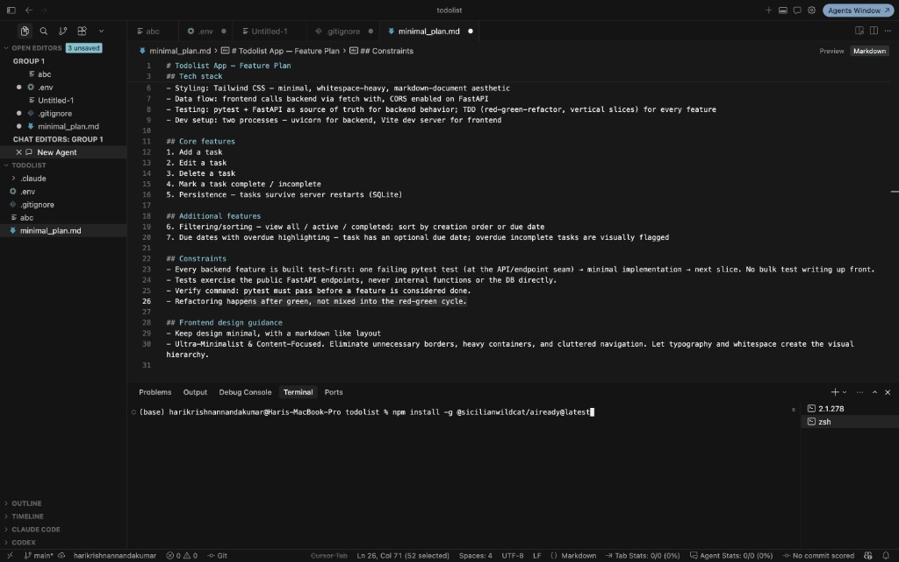

To organize this into a proper entry point file like AGENTS.md, I ran aiready's audit and init commands. audit picks up all available artifacts (in this case minimal_plan.md), scores them against a predefined set of rules using an LLM (Sonnet 5), and produces a triage of gaps to fill. This is the point where I added my own input to resolve the gaps it flagged as needing human decisions, before running init, which automatically generates artifact files such as ARCHITECTURE.md, features.md, PROGRESS.md, SESSION-HANDOFF.md, startup.md, structure.md, and TASK.md.

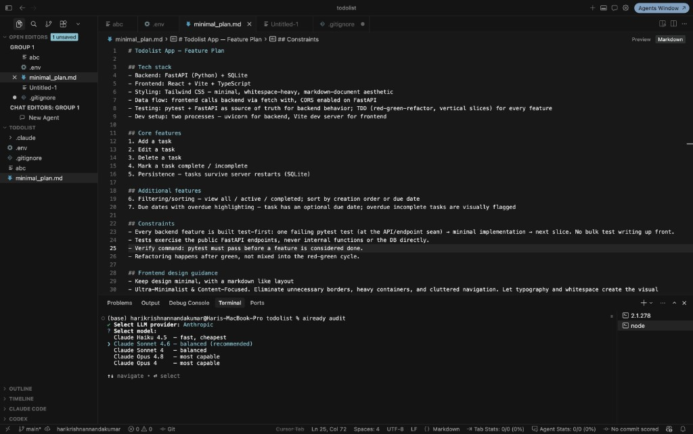

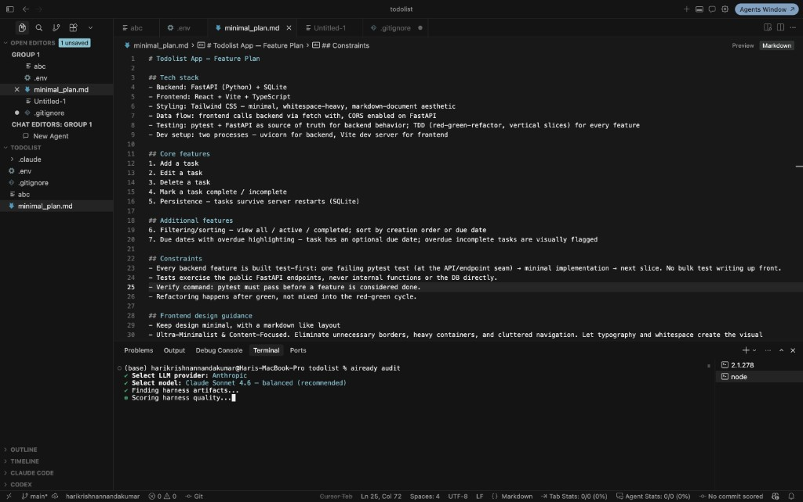

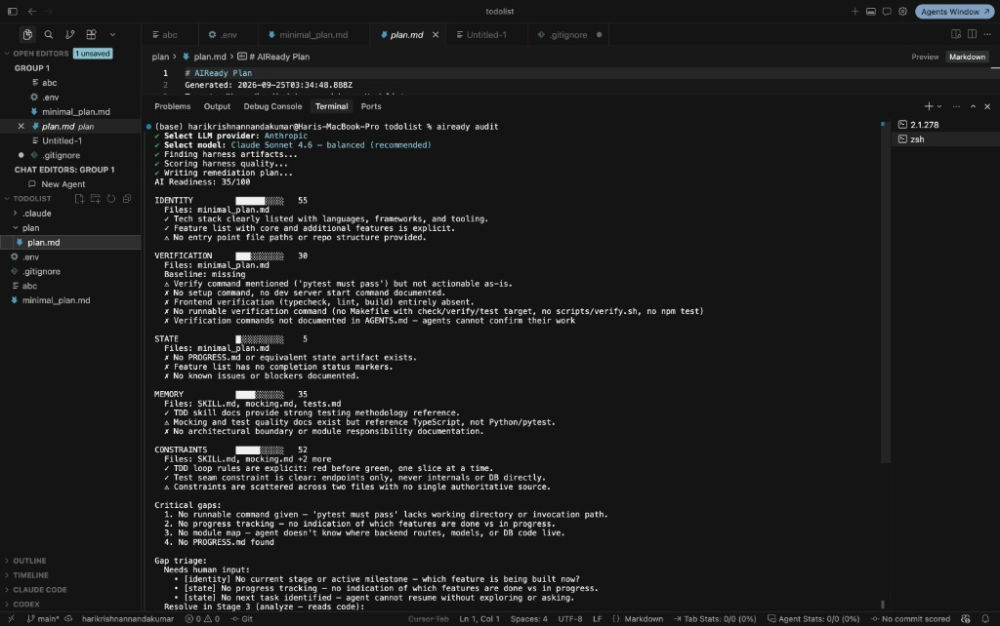

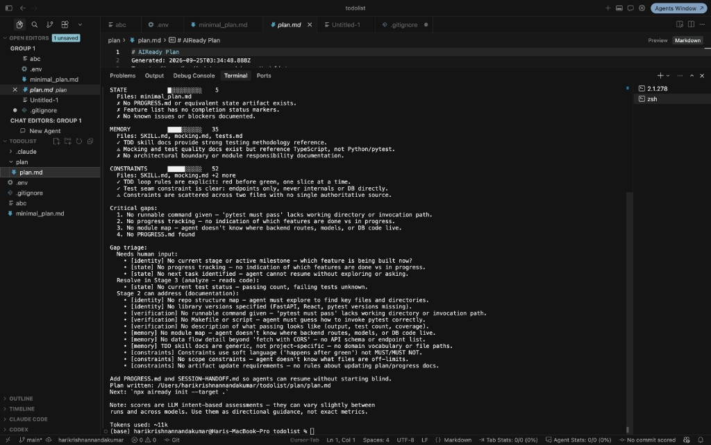

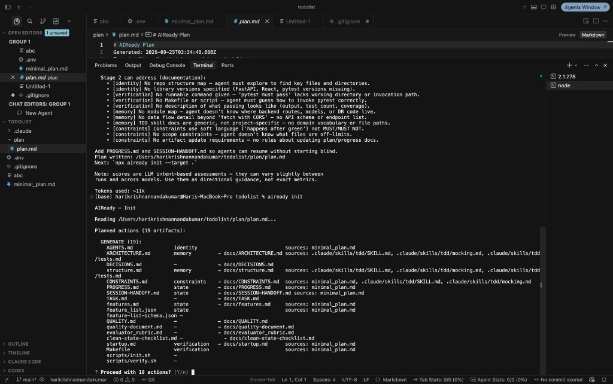

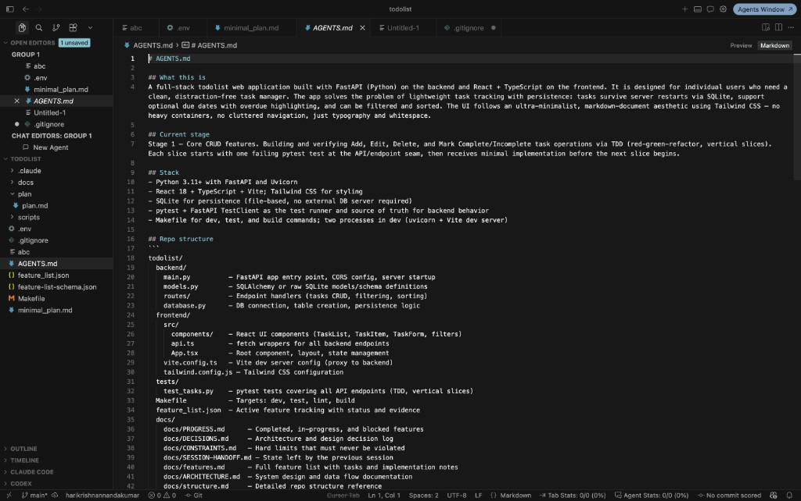

It's usually better to organize a harness this way, since each file stays under about 150 lines, which keeps it easy for a coding agent to parse and act on without re-deriving context every session.

While this level of rigor isn't strictly necessary for a simple todo list app, I approached it the way I would approach a larger application, using Matt Pocock's test-driven-development skill. I loaded this into Claude Code and used it while generating my harness artifacts, so the resulting test suite would hold every feature to a strict red-green-refactor loop rather than something looser. As a result, my AGENTS.md ended up architecturally sound before a single line of app code existed.

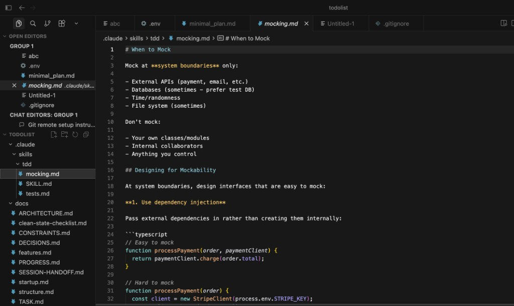

The problem was that aiready's init command also generated a full suite of docs I didn't need, like QUALITY.md and evaluator_rubric.md, which acted as pure noise. I stepped in and cut the artifact files down to only what this build actually needed, then read through everything that remained to confirm it matched my intent. I caught a real bug this way: the generated scripts/verify.sh called make build-frontend and make typecheck-frontend, Makefile targets that didn't actually exist (the Makefile only defined build and typecheck), and scripts/init.sh called make install-backend and make install-frontend, which also didn't exist. AGENTS.md compounded this by telling the agent to run ./init.sh when the file actually lived at scripts/init.sh. Since this is the very first thing a session runs, it would have failed before any feature work began. I fixed all of it, along with a separate contradiction where docs/features.md specified PATCH for editing a task while feature_list.json specified PUT for the same endpoint, before sending my first prompt to Claude Code.

From there, I gave Claude Code my first prompt, asking it to follow the instructions in AGENTS.md (Claude Code reads AGENTS.md natively now, so a separate CLAUDE.md wasn't necessary) and build features in priority order. Each session follows a clear SOP that I dictated: verify the current build is in a passing state by running the full verification suite defined in startup.md, focus on exactly one active feature at a time instead of parallel work (where split attention tends to produce half-finished features), generate a sprint contract using the TASK.md template before starting, scoping the work and its acceptance criteria against the completion gate in AGENTS.md so that completion can only be claimed with runnable verification evidence, build every feature through a strict red-green-refactor loop (one failing pytest test at the FastAPI endpoint seam, only enough code to pass it, refactor only after green, never testing internals directly and never writing tests in bulk ahead of implementation), and update logs such as PROGRESS.md, SESSION-HANDOFF.md, and DECISIONS.md, which together act as the sole source of truth for every decision made during the build, so the next session doesn't waste time or tokens re-deriving context before proposing a plan.

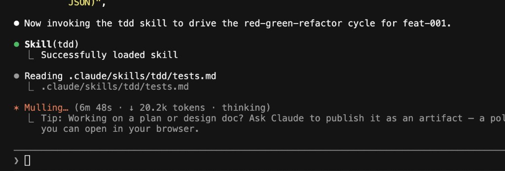

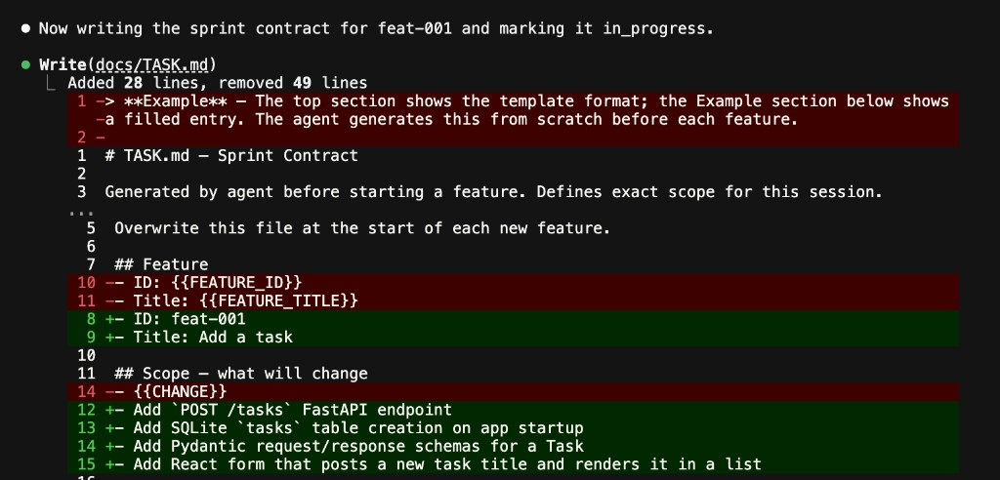

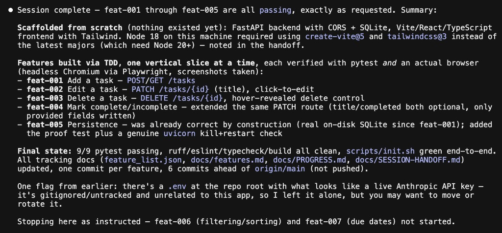

## 2. What did AI get wrong, and how did you fix it?

The first wrong output didn't come from Claude Code building the app itself, it came from my own harness generator. aiready's init step produced QUALITY.md, quality-document.md, and evaluator_rubric.md as unfilled templates that still contained content from a completely unrelated project, domains like "Document Import" and "Q&A Flow," and Electron's "Main Process," "Preload," and "Renderer" layers. None of that has anything to do with a FastAPI todo app. More concerning, docs/ARCHITECTURE.md and docs/structure.md had been generated using my TDD skill's own reference files as source material, so they ended up documenting a "TDD Skill Layer" and a "Mocking Boundary Layer" as if those were part of my application's architecture. The generator had confused its own scaffolding tooling for the thing it was supposed to document. I deleted the noise docs outright and flagged the architecture files as needing a full rewrite once real code existed, instead of letting an agent inherit a wrong mental model of its own codebase from session one.

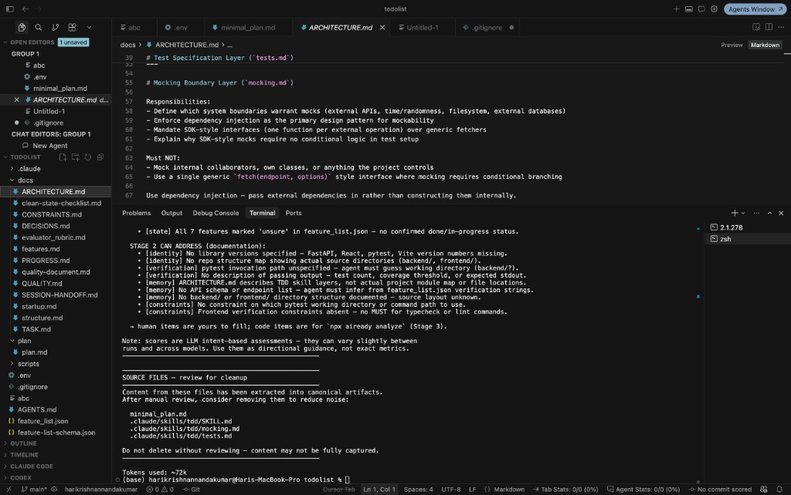

## 3. What did you deliberately not delegate to AI and why?

There were three things I kept for myself rather than delegating. First, the actual feature scope and stack choice. I picked FastAPI because I know Python better than backend JS, and I wanted a stack I could defend in a grading conversation rather than one I was hoping would just work. Second, every harness artifact went through my own read before I trusted it. aiready's audit output explicitly separates gaps it can fill on its own from ones it flags as needing human input, like the current build stage or the next task, and I made sure those were resolved by me, not guessed at during generation. Third, I didn't delegate verifying AI's own claim of completion. feature_list.json marking something "passing" isn't the same as it being true, so I reviewed the actual diffs, read the pytest evidence, and where I could, ran the app myself instead of taking the JSON's word for it.

## 4. What would you do differently with more time?

With more time I'd bring frontend testing into the real verification pipeline. The Playwright checks I ran were genuine but manual and ad hoc, not wired into make check the way the backend's pytest suite is, so they're not enforced the same way. After the first prompt-build session, I noticed that the frontend build did not meet my expectation much as it was rather plain, and the critieria i set was not verified vigorously as the agent didn't have a way to access and traverse through the app from the perspective of a user, verifying whehter the frontend rendered accordingly.

## Harness score, before and after

Before any of this, aiready scored the repo 35/100 across its five subsystems. After I filled in the harness, cut the noise, fixed the bugs I found, and finished the build, I re-ran the audit: 61/100, a 26 point increase.

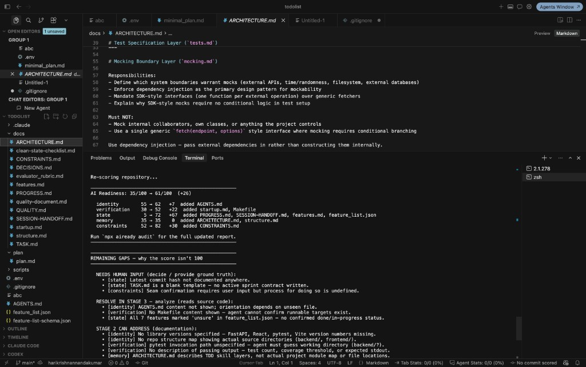

Broken down by subsystem:
- identity: 55 to 62 (+7), from AGENTS.md
- verification: 30 to 52 (+22), from startup.md and the Makefile
- state: 5 to 72 (+67), from PROGRESS.md, SESSION-HANDOFF.md, features.md, and feature_list.json
- memory: 35 to 35 (0), from ARCHITECTURE.md and structure.md [Since the coding session hasn't begun yet.]
- constraints: 52 to 82 (+30), from CONSTRAINTS.md
